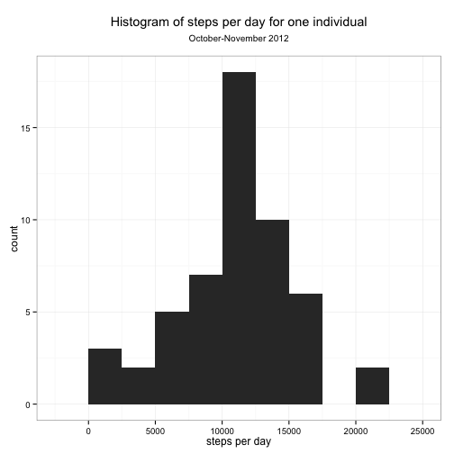
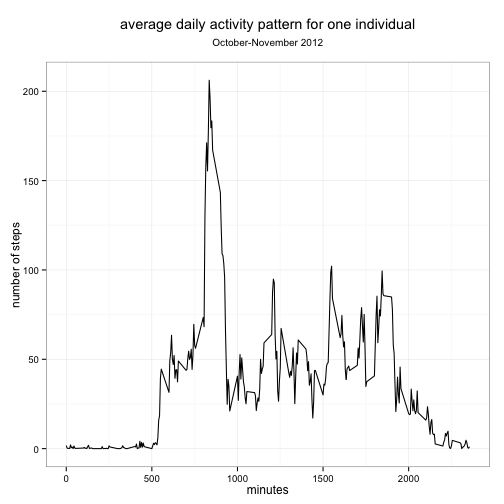
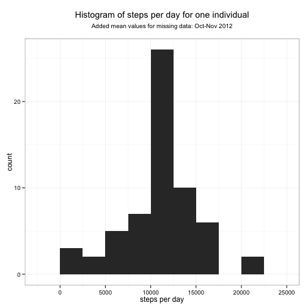
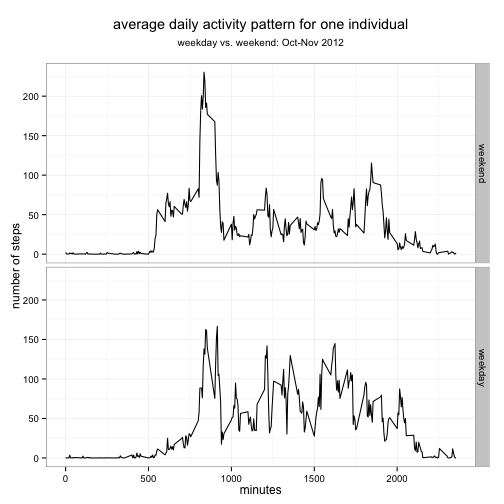

The goal of this workflow is to process and summarize data from the activity 
monitoring dataset, a collection of two months footstep counts from a random 
indivudal spanning from October to November of 2012. 


## Loading and preprocessing the data

First we need to load necessary libraries, Unzip the data (if necessary), 
load into this R session, and convert factor data for the date into POSIXct data.


```r
library('ggplot2')
library('reshape2')

if (!file.exists("activity.csv")){
  message("Unzipping")
  unzip("activity.zip")
}
activity <- read.csv("activity.csv")
activity$date <- as.POSIXct(activity$date)
```

## What is mean total number of steps taken per day?

To get the total number of steps per day, we can use tapply, then create 
a histogram of this data followed by calculating the mean and median. We 
can see from the plot that the average number of steps over this time period
is roughly normally distributed. 


```r
steps.per.day <- tapply(activity$steps,activity$date,sum)
ggplot(as.data.frame(steps.per.day),aes(x=steps.per.day))+
    geom_histogram(binwidth=2500)+
    ggtitle(expression(atop("Histogram of steps per day for one individual",
                            atop("October-November 2012"))))+
    labs(x="steps per day",y="count")+theme_bw()
```

 

```r
# mean steps per day
mean(steps.per.day,na.rm=TRUE)
```

```
## [1] 10766.19
```

```r
#median steps per day
median(steps.per.day,na.rm=TRUE)
```

```
## [1] 10765
```


## What is the average daily activity pattern?

In order to determine the average daily activity pattern, we again use 
tapply to summarize the data by time interval. Assuming midnight is zero, 
on average, there is heavy traffic in the morning followed by spurts 
throughout the day. 


```r
steps.per.interval.mean <- tapply(activity$steps,activity$interval,
                                  mean,
                                  na.rm=TRUE)
ggplot(as.data.frame(steps.per.interval.mean),
       aes(x=as.numeric(rownames(steps.per.interval.mean)),
           y=steps.per.interval.mean))+
    geom_line()+
    ggtitle(expression(atop("average daily activity pattern for one individual",
                            atop("October-November 2012"))))+
    labs(x="minutes",y="number of steps")+
    theme_bw()
```

 

```r
# which interval has the highest average number of steps?
names(steps.per.interval.mean)[which(steps.per.interval.mean %in% 
                            max(steps.per.interval.mean))]
```

```
## [1] "835"
```

## Imputing missing values

It was decided to use the mean value for the interval to replace NA values, 
You can see from the following plot that the overall general shape of 
the histogram does not change, but the sums over days shift towards the mean. 
As for summary statistics, the median shifts very slightly to the mean value. 


```r
#create a new dataset
activity.addNA <- activity
#where the NAs are 
steps.NAs <- !complete.cases(activity.addNA$steps)
#replace the NA values with the median
activity.addNA$steps[steps.NAs] <- steps.per.interval.mean[
    match(names(steps.per.interval.mean),sapply(activity.addNA$interval[steps.NAs],
                                                toString))]
steps.per.day.addNA <- tapply(activity.addNA$steps,activity.addNA$date,sum)
ggplot(as.data.frame(steps.per.day.addNA),aes(x=steps.per.day.addNA))+
    geom_histogram(binwidth=2500)+
    ggtitle(expression(
        atop("Histogram of steps per day for one individual",
             atop("Added mean values for missing data: Oct-Nov 2012"))))+
    labs(x="steps per day",y="count")+theme_bw()
```

 

```r
# mean steps per day
mean(steps.per.day.addNA)
```

```
## [1] 10766.19
```

```r
#median steps per day
median(steps.per.day.addNA)
```

```
## [1] 10766.19
```

## Are there differences in activity patterns between weekdays and weekends?

From the plot below, it seems that less steps are taken during the earlier 
timepoints on the weekend, but there are more steps during the day on weekdays. 


```r
activity.addNA$day <- 
    sapply(activity.addNA$date,
           function(x) ifelse(
               weekdays(x) == "Saturday"|weekdays(x) == "Sunday",
               "weekend",
               "weekday"))
steps.per.interval.mean.day <- tapply(activity.addNA$steps,
                                  list(activity.addNA$interval,activity.addNA$day),
                                    mean)
colnames(steps.per.interval.mean.day) <- c("weekend","weekday")
steps.per.interval.mean.day.melt <- melt(steps.per.interval.mean.day)
colnames(steps.per.interval.mean.day.melt) <- c("interval","day","average.steps")
ggplot(steps.per.interval.mean.day.melt,aes(x=interval,y=average.steps))+
    geom_line()+
    ggtitle(expression(atop("average daily activity pattern for one individual",
                            atop("weekday vs. weekend: Oct-Nov 2012"))))+
    labs(x="minutes",y="number of steps")+facet_grid(day~.)+
    theme_bw()
```

 
